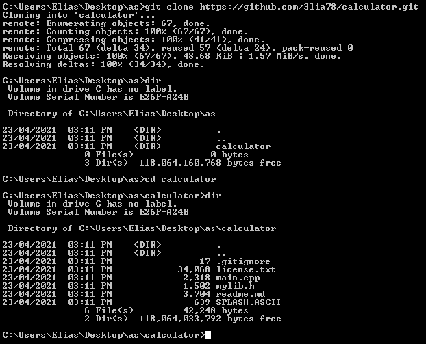
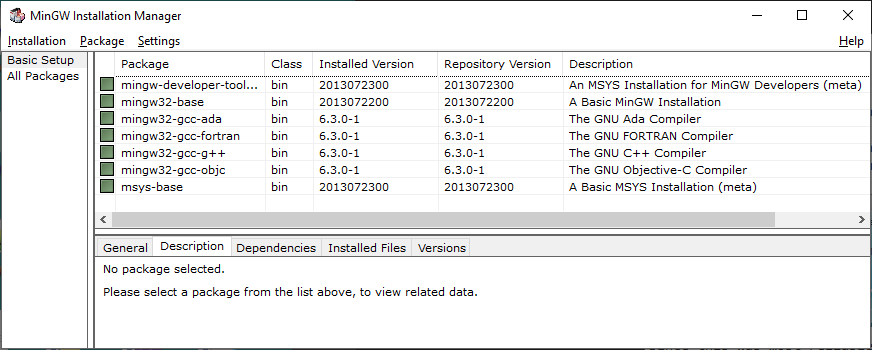
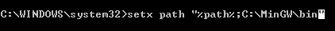
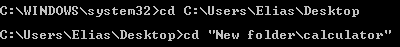
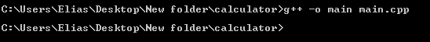
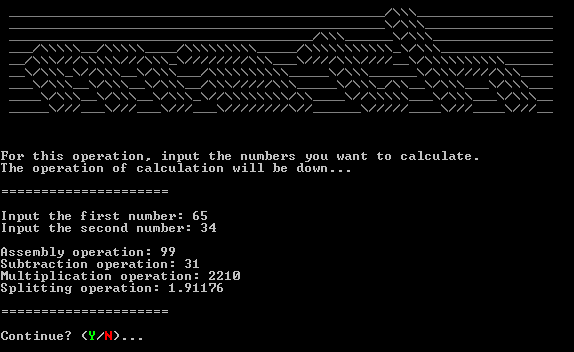

<h1>Hellu</h1>
My name is TheRealOne78 and this is one of my first public projects.

<h2>What is this program?</h2>
It's a calculator. It's actually my first code I've started coding when I was 5th grade. Yes, my first ever program wasn't actually a 'hello world' program.

I've finally made it work after all this years of being forgotten in an old hard drive.

So... now I made possible for you to use it, _even if you probably don't even care_ :)

Now you'll probably hate me because you _probably_ hate math, but I hate math too, so ... idk ¯\\\_(ツ)_/¯

<h2>What language was this program created</h2>

Since this was most reliable and the language I know well, it's written in C++ with a little help of `system()` calls.

<h2>How do I make this work?</h2>

First you need to download the code. You can type `git clone https://github.com/TheRealOne78/calculator.git` in your terminal, or you can download using the `download zip` button in `Code` dropdown menu button.
BTW, make sure you download ***all*** files.

Next you need to compile it using a compiler.
A compiler is a program that translates human code, in this example C++, into computer binary code that a machine can understand.
More about compiling at [compiling](#compiling) section.

<h2>Compiling...</h2>

You need first to download a C++ compiler. If you are a GNU/Linux user, most probably you have already installed the GCC set of compilers. You can verify it by typing `whereis g++` in your terminal. If not, you can download it with `sudo apt-get install g++` command in case you use a debian-based Linux distribution.
In windows, you can install the free version MinGW GCC [here]("https://sourceforge.net/projects/mingw/")
Install the MINGW manager, and install the G++ basic compiler.

After that, you might want to path it to the system. To path it, in cmd run `setx path "%PATH%;path_you_installed_mingw\bin"`.

To compile, in your terminal execute `g++ -o calculator ./src/*.c*`. 
**Note** that you need to be in the root directory of the repository.

After that you can run the file.

<h2>How do I use this file?</h2>

First double click the executable file you compiled. In windows, it should end with `.exe`.
After that, a console window will apear.

There it will ask you to type 2 numbers:
<ol>
  <li>The first you want to calculate</li>
  <li>The second you want to calculate</li>
</ol>

Press enter and the results will be shown.

After that, the program will be asking you if you want to calculate more things. You can chose n(no) or y(yes). You can also put uppercase letters. If you made a mistake, the program will ask again for a letter.
In case you run in a loop of errors because you probably entered not a 16 bit value into the char, then after 10 errors the calculator will exit with return 0x1 status.

<h2>How do I configure the ASCII file?</h2>

You might want to add something else instead of math ASCII art. Math is pretty boring, as well should be an ASCII art of the word math.

Open SPLASH.ASCII with any text editor, eg. vim, and replace or add there anything you want to display the calculator starts.
You might be also sure about the size of the console window... If the size is too small, the charcaters that should be in one line will go in another line. But probably it should be fine if it's a letter to grandma.

After saving, you should see your change in my program... ***our program*** :)

Congrats, you made it!
